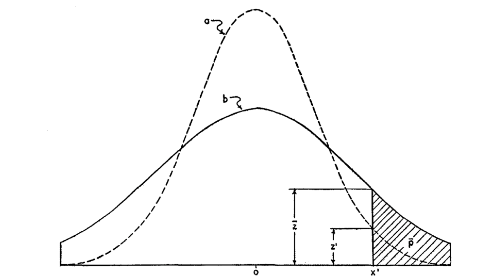

```{r, echo=TRUE, warning=FALSE, message=FALSE}
library(knitr)
library(TwoSampleMR)
library(simulateGP)
knitr::opts_chunk$set(echo=TRUE, message=FALSE, warning=FALSE, dev="png", cache=TRUE)
```


## Background

Predictions are being acted upon, which influence the outcomes that they are predicting. For example:

- Family history
- Knowledge of risk factors 
- Your current phenotype is a prediction of your future phenotype (e.g. your BMI today is partly due to how you have responded to your BMI in the past)
- Straight-to-consumer genetic tests
- Individuals who take drugs (e.g. statins) are excluded from studies on LDL cholesterol?

Now there are polygenic scores which could be rolled out to the population. What happens when everyone has had a prediction, and then later on they contribute to the (e.g.) GWAS used to construct the next prediction?


## Simulation framework

Simulate waves of samples

Wave 1: 10000 training; everyone in wave 2 is predicted
Wave 2: 10000 training, who were all predicted during wave 1 and may have acted on their prediction; predict everyone

```{r}
ids <- 1:100000
training1 <- 1:10000
training2 <- 10001:20000
prediction1 <- ids[-training1]
prediction2 <- ids[-c(training1, training2)]
```


## Scenario 1

Modifiable risk factor is predicted and acted upon. What happens to association test of individuals who have done this?

Create a model

```{r}
npred <- 100
x <- matrix(rnorm(npred * length(ids)), length(ids), npred)
e <- rnorm(length(ids))
xeff <- rnorm(npred, sd=0.01)
y <- x %*% xeff + e
cor(y, x %*% xeff)
```

Train the predictor

```{r}
mod1 <- lm(y ~ ., data=data.frame(y=y[training1], x=x[training1,]))
cor(xeff, mod1$coefficients[-1])
```

Create the predictor

```{r}
pred1 <- predict(mod1, data.frame(x=x[prediction1,]))
```

How well does it work?

```{r}
lm(y[prediction1] ~ pred1)
plot(y[prediction1] ~ pred1)
```

Population samples respond to their prediction. Higher prediction = bigger percentage reduction in $x$

```{r}
response_factor <- function(prediction, variable)
{
	mod_factor <- rank(-prediction) / length(prediction)
	return(t(t(variable) * mod_factor))
}
x1 <- response_factor(pred1, x[prediction1,])
plot(apply(x1, 2, var) ~ apply(x, 2, var))
```

Compare how the variance in $x$ has dropped

```{r}
var(x) %>% diag %>% mean
var(x1) %>% diag %>% mean
# cor(x1, x[prediction1,]) %>% diag
# cor(x1, y[prediction1])
# cor(x[prediction1], y[prediction1])
```

How has the mean in $x$ changed?

```{r}
mean(x)
mean(x1)
```

Construct updated $y$ given new $x$

```{r}
y1 <- x1 %*% xeff + e[prediction1]
```

Now how does the association between x and y change in the second wave, after individuals have already acted on their earlier predictions?

```{r}
mod2 <- lm(y ~ ., data=data.frame(y=y1[training2], x=x1[training2,]))
plot(mod2$coefficients[-1] ~ mod1$coefficients[-1])
```

The standard errors of the effect estimates have increased

```{r}
cor(mod2$coefficients[-1], mod1$coefficients[-1])
smod1 <- summary(mod1)
smod2 <- summary(mod2)
mean(smod1$coefficients[-1,2])
mean(smod2$coefficients[-1,2])
```

And the prediction accuracy has actually gone down.

```{r}
pred2 <- predict(mod2, data.frame(x=x1))
cor(pred2, y[prediction1])
cor(pred1, y[prediction1])
```

**Summary:**

When you intervene on a set of risk factors, much of the variance is reduced, which means that all things equal the next time you make a predictor it will perform worse.


## Scenario 2

The phenotype $y$ is continuous, and influenced by a vector of non-modifiable genetic factors $G$ that have effects $b_g$, a modifiable environmental factor $x$ that has effect $b_x$ and some residual noise $e$. Here, $x \sim Binom(1, 0.5)$ to make it simple to intervene on it.

$$
y = a + Gb_g + xb_x + e
$$

Simple case - if you are in the top quartile of estimated genetic risk from wave 1, you intervene to make your modifiable risk $x=0$. Wave 2 proceeds, and the GWAS on the training sample performed. Note that this training sample has intervened, and will have an updated phenotype.

Here the situation is different because you can intervene only on components that are not related to the phenotype





```{r}
library(simulateGP)

# How many causal variants
nsnp <- 40

# Create genotypes for population
G <- make_geno(
	nid = length(ids), 
	nsnp = nsnp, 
	af = 0.5
)

# Genotype effects together explain 30% of phenotype
b_gy <- choose_effects(
	nsnp = nsnp, 
	totvar = 0.3
)

# Simulate modifiable exposure
x <- runif(length(ids))

# Simulate phenotype. x explains 30% of phenotype also
evec <- scale(rnorm(length(ids))) * sqrt(0.4)
gvec <- scale(G %*% b_gy) * sqrt(0.3)
xvec <- scale(x) * sqrt(0.3)
y <- gvec + xvec + evec

cor(y, x)^2

# Get effects in training wave 1
b_ghat1 <- gwas(y[training1], G[training1,])

# Create predictor for wave 1
g_hat1 <- G[prediction1,] %*% b_ghat1$bhat

# The higher your genetic score, the bigger the reduction in your x
mod_factor1 <- rank(-g_hat1) / length(g_hat1)
plot(mod_factor1 ~ g_hat1)
plot(mod_factor1 ~ g_hat1)
x1 <- x
x1[prediction1] <- x[prediction1] * mod_factor1

cor(x1, x)
cor(x, y)
cor(x1, y)

# The variance in x1 will decrease, by factor:
b_x1 <- sd(x1) / sd(x)

# Update the phenotypes for these individuals
y1 <- gvec + evec + scale(x1) * sqrt(0.3) * b_x1
cor(y, y1)

# Perform GWAS on wave 2
b_ghat2 <- gwas(y1[training2], G[training2,])

gwas(x1[training2], G[training2,])
gwas(x[training2], G[training2,])

cor(b_ghat1$bhat, b_ghat2$bhat)

mean(b_ghat1$bhat)
mean(b_ghat2$bhat)
mean(b_ghat1$se)
mean(b_ghat2$se)
median(b_ghat1$pval)
median(b_ghat2$pval)
sum(b_ghat1$pval < 0.05)
sum(b_ghat2$pval < 0.05)
mean(b_ghat1$fval)
mean(b_ghat2$fval)


d <- get_effs(x1[prediction2], y1[prediction2], G[prediction2,])
library(TwoSampleMR)

mr(d)
```

**Summary:**

The average F statistic for the genetic effects on y have reduced in the second wave. 

Importantly though, after acting on prediction from the first wave, the genetic factors now associate with the modifiable risk factor. These are spurious associations.


## Scenario 3

The phenotype $y$ is continuous, and influenced by a vector of genetic factors $G$ that have effects $b_g$, a modifiable environmental factor $x$ that has effect $b_x$ and some residual noise $e$.

The risk factor $x$ is partially modifiable, partially genetic, and partially due to residual noise

$$
x = \alpha + G_{x}b_{gx} + mb_m + \epsilon
$$

Here, $m \sim U(0, 1)$ for convenience of simulating an intervention. The outcome of interest $y$ has its own independent genetic and noise components and is influenced by $x$

$$
y = a + G_{y}b_{gy} + xb_{x} + e
$$

Simple case - use wave 1 to create a predictor for the population. In the population, the higher your overall genetic risk, the bigger the reduction in the modifiable component of your exposure $m$, which leads to a modified y value. The updated $x$ value will be

$$
x^{*} = \alpha + G_{x}b_{gx} + mb_{m} \cdot \hat{g}^{-1} + \epsilon
$$

and the updated $y$ value will be

$$
y^{*} = a + G_{y}b_{gy} + x^{*}b_{x} + e
$$


```{r}

# How many causal variants
xsnp <- 1:100
ysnp <- 101:200
nsnp <- length(c(xsnp, ysnp))

# Create genotypes for population
G <- make_geno(
	nid = length(ids), 
	nsnp = nsnp, 
	af = 0.5
)

# Genotype effects together explain 30% of phenotype
b_gy <- choose_effects(
	nsnp = length(ysnp), 
	totvar = 0.3
)

b_gx <- choose_effects(
	nsnp = length(xsnp), 
	totvar = 0.3
)

# Simulate modifiable exposure
m <- runif(length(ids))
epsilon <- rnorm(length(ids))
x <- G[,xsnp] %*% b_gx + m * 3 + epsilon

cor(x, m)^2
cor(x, G[,xsnp] %*% b_gx)^2


# Simulate y
evec <- rnorm(length(ids))
y <- G[,ysnp] %*% b_gy + x * 0.5 + evec

cor(y, m)^2
cor(y, G[,ysnp] %*% b_gy)^2
cor(y, x)^2

# Get effects in training wave 1
b_gyhat1 <- gwas(y[training1], G[training1,])

# Create predictor for wave 1
g_hat1 <- G[prediction1,] %*% b_gyhat1$bhat


# The higher your genetic score, the bigger the reduction in your x
mod_factor1 <- rank(-g_hat1) / length(g_hat1)
plot(mod_factor1 ~ g_hat1)
x1 <- x
x1[prediction1] <- x[prediction1] * mod_factor1

cor(x1, x)
cor(x, y)
cor(x1, y)

# Update the phenotypes for these individuals
y1 <- G[,ysnp] %*% b_gy + x1 * 0.5 + evec
cor(y, y1)

# Perform GWAS on wave 2
b_gyhat2 <- gwas(y1[training2], G[training2,])

res <- bind_rows(
	gwas(x[training2], G[training2,]) %>% 
	mutate(phenotype = 'effects on x', when="wave 1", influence = c(rep('x and y', length(xsnp)), rep('y only', length(ysnp)))),
	gwas(x1[training2], G[training2,]) %>% 
	mutate(phenotype = 'effects on x', when="wave 2", influence = c(rep('x and y', length(xsnp)), rep('y only', length(ysnp)))),
	gwas(y[training2], G[training2,]) %>% 
	mutate(phenotype = 'effects on y', when="wave 1", influence = c(rep('x and y', length(xsnp)), rep('y only', length(ysnp)))),
	gwas(y1[training2], G[training2,]) %>% 
	mutate(phenotype = 'effects on y', when="wave 2", influence = c(rep('x and y', length(xsnp)), rep('y only', length(ysnp))))
)

res %>%
ggplot(., aes(x=snp, y=-log10(pval))) +
geom_point(aes(colour=influence)) +
facet_grid(phenotype ~ when)

```

**Summary:**

The genetic effects on x change dramatically between wave 1 and 2. In wave 1, SNPs that directly influence y do not associate with x, but in wave 2 there are associations induced between x and SNPs influencing y. We also see a reduction in the test statistic for the correct SNPs for x.

In terms of the genetic effects on y, they are largely consistent but the power reduces.


## Scenario 4

There is now also a genetic factor that influences your response to information. If you have a high genetic score for your response to information $r$, then you will more likely modify your modifiable risk factor.

Examples of $r$

- Personality trait, for being proactive etc
- Genetic influence on the likelihood of getting genetic information e.g. more wealthy, higher education etc.

```{r}
# How many causal variants
xsnp <- 1:100
ysnp <- 101:200
rsnp <- 201:300
nsnp <- length(c(xsnp, ysnp, rsnp))

# Create genotypes for population
G <- make_geno(
	nid = length(ids), 
	nsnp = nsnp, 
	af = 0.5
)

# Genotype effects together explain 30% of phenotype
b_gy <- choose_effects(
	nsnp = length(ysnp), 
	totvar = 0.3
)

b_gx <- choose_effects(
	nsnp = length(xsnp), 
	totvar = 0.3
)

b_gr <- choose_effects(
	nsnp = length(rsnp), 
	totvar = 0.3
)

# Simulate modifiable exposure
m <- runif(length(ids))
epsilon <- rnorm(length(ids))
x <- G[,xsnp] %*% b_gx + m * 3 + epsilon

cor(x, m)^2
cor(x, G[,xsnp] %*% b_gx)^2


# Simulate y
evec <- rnorm(length(ids))
y <- G[,ysnp] %*% b_gy + x * 0.5 + evec

cor(y, m)^2
cor(y, G[,ysnp] %*% b_gy)^2
cor(y, x)^2

# Get effects in training wave 1
b_gyhat1 <- gwas(y[training1], G[training1,])

# Create predictor for wave 1
g_hat1 <- G[prediction1,] %*% b_gyhat1$bhat


# The higher your genetic score, the bigger the reduction in your x
# The higher your response score, the higher the chance you act on your response

rscore <- G[,rsnp] %*% b_gr %>% scale
mod_factor1 <- rank(-g_hat1) / length(g_hat1)
plot(mod_factor1 ~ g_hat1)
x1 <- x
x1[prediction1] <- x[prediction1] * mod_factor1 * rscore[prediction1]

cor(x1, x)
cor(x, y)
cor(x1, y)

# Update the phenotypes for these individuals
y1 <- G[,ysnp] %*% b_gy + x1 * 0.5 + evec
cor(y, y1)

# Perform GWAS on wave 2
b_gyhat2 <- gwas(y1[training2], G[training2,])

res <- bind_rows(
	gwas(x[training2], G[training2,]) %>% 
	mutate(phenotype = 'effects on x', when="wave 1", influence = c(rep('x and y', length(xsnp)), rep('y only', length(ysnp)), rep('response', length(rsnp)))),
	gwas(x1[training2], G[training2,]) %>% 
	mutate(phenotype = 'effects on x', when="wave 2", influence = c(rep('x and y', length(xsnp)), rep('y only', length(ysnp)), rep('response', length(rsnp)))),
	gwas(y[training2], G[training2,]) %>% 
	mutate(phenotype = 'effects on y', when="wave 1", influence = c(rep('x and y', length(xsnp)), rep('y only', length(ysnp)), rep('response', length(rsnp)))),
	gwas(y1[training2], G[training2,]) %>% 
	mutate(phenotype = 'effects on y', when="wave 2", influence = c(rep('x and y', length(xsnp)), rep('y only', length(ysnp)), rep('response', length(rsnp))))
)

res %>%
ggplot(., aes(x=snp, y=-log10(pval))) +
geom_point(aes(colour=influence)) +
facet_grid(phenotype ~ when) +
scale_colour_brewer(type="qual")

```

**Summary:**

The genetic factors that determine whether you are likely to respond to prediction, after wave 2 following action, now strongly associate with both x and y. 


## Next steps

- What other models to consider?
	+ How are effect size estimates affected if only some individuals have the predictor
	+ Longitudinal effects e.g. previous BMI influences future behaviour
- Empirical analyses 
	+ if individuals in UKBB report parents' phenotypes then can this be used as a proxy for the proband having received a prediction?
	+ Are individuals who report parents' outcomes susceptible to lower prediction accuracy than individuals who don't report parents' outcomes?
	+ Is there a genetic association which relates to the difference between the expected (based on parents) and observed outcome, which would perhaps relate to propensity to respond to prediction?


If the genetic influence on the outcome is completed mediated by a modifiable trait. 


```{r, eval=FALSE, echo=FALSE}

# How many causal variants
nsnpy <- 20
nsnpx <- 20

# Create genotypes for population
Gx <- make_geno(
	nid = length(ids), 
	nsnp = nsnpx, 
	af = 0.5
)
Gy <- make_geno(
	nid = length(ids), 
	nsnp = nsnpy, 
	af = 0.5
)

# Genotype effects together explain 30% of phenotype
b_gx <- choose_effects(
	nsnp = nsnpx, 
	totvar = 0.3
)
b_gy <- choose_effects(
	nsnp = nsnpy, 
	totvar = 0.3
)

# Simulate modifiable exposure
m <- runif(length(ids))

# Simulate x
epsilon <- rnorm(length(ids)) * sqrt(0.4)
x <- scale(Gx) %*% b_gx + m * 3 + epsilon
cor(x, m)
cor(x, Gx %*% b_gx)

# Simulate phenotype. x explains 30% of phenotype also
evec <- scale(rnorm(length(ids))) * sqrt(0.4)
gvec <- scale(Gy) %*% b_gy
xvec <- x * sqrt(0.3)
y <- gvec + xvec + evec

cor(y, x)^2
cor(y, m)^2

# Get effects in training wave 1
b_gyhat1 <- gwas(y[training1], cbind(Gy[training1,], Gx[training1,]))

# Create predictor for wave 1
g_hat1 <- cbind(Gy[prediction1,], Gx[prediction1,]) %*% b_gyhat1$bhat

cor(g_hat1, cbind(Gy[prediction1,], Gx[prediction1,]) %*% c(b_gy, b_gx))

# The higher your genetic score, the bigger the reduction in your x

m1 <- response_factor(g_hat1, m[prediction1])
plot(g_hat1, m1/m[prediction1])

# Update the phenotypes for these individuals
x1 <- scale(Gx[prediction1,]) %*% b_gx + m1 * 3 + epsilon[prediction1]
y1 <- gvec[prediction1] + evec[prediction1] + x1 * sqrt(0.3)

cor(x1, x[prediction1])
cor(x, y)
cor(x1, y1)
cor(y[prediction1], y1)

# Perform GWAS on wave 2
b_gyhat2 <- gwas(y1[training2], cbind(Gy[training2,], Gx[training2,]))

plot(b_gyhat1$bhat ~ b_gyhat2$bhat)
plot(b_gyhat1$bhat ~ c(b_gy, b_gx))
plot(b_gyhat2$bhat ~ c(b_gy, b_gx))


gwas(x1[training2], Gy[training2,])
gwas(x[training2], Gy[training2,])

gwas(x1[training2], Gx[training2,])
gwas(x[training2], Gx[training2,])

gwas(y1[training2], Gx[training2,])
gwas(y[training2], Gx[training2,])

cor(b_gyhat1$bhat, b_gyhat2$bhat)


gwas(m[training2], Gy[training2,])
gwas(m1[training2], Gy[training2,])

gwas(m1[training2], Gy[training2,])


d <- get_effs(x1[prediction2], y1[prediction2], G[prediction2,])
library(TwoSampleMR)

mr(d)
```


<!-- 

X influenced by polygenic effect

X = Gx + E

Know and act
Know and don't act

E = knowing your prediction

Bigger predictor, more likely to act

E = K * Ga + e

X = Gx + K * Ga + e

Sample 1 - build predictor for X
Sample 2 - 

 -->